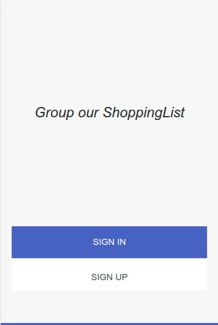
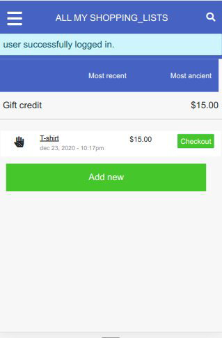

# Group our ShoppingList

### Eric Enaburekhan Ruby on Rails Capstone project

> Group our ShoppingList is a web application with a responsive behavior for mobile usage built with Ruby on Rails. This mobile web application is use for grouping payments by a goal with your family/friends. You can find the full requirements [here](https://www.notion.so/Group-our-transactions-ccea2b6642664540a70de9f30bdff4ce). Inspecting this project, you can find the following options (login, sign-in, all my shopping_list, all my external shopping_list, all groups, log out and a checkout a shopping_list as an additional feature).
One is required to sign-up/sign-in before you can start using the application. Group our ShoppingList is similar to an online store where you purchase items grouped into a category called shopping cart while the list of items grouped into the category of I will save and review later are referred to as shopping list. Thus, Group our ShoppingList app allows you to group and save a list of items to review and purchase on a later date.
If you don't want your item/product to be associated with any category, you can create a shopping list that will not be associated with any group or category. The checkout is an extra feature I added so one can be able to proceed with the check out for any of the items you saved. 

## Built With

- Ruby v2.7.0
- Ruby on Rails v6.3.0.4
- Git

### Screenshots
<p float = 'left'>
    
    
</p>

## Live Demo

[Group our ShoppingList](https://enaburekhan-shoppinglist-app.herokuapp.com/)

## Video link
[Group our shopping_list](https://www.loom.com/share/72e6ba867cb648f6b5986a878ee4048d)


## Getting Started

To get a local copy up and running follow these simple example steps.

### Prerequisites

- Ruby v2.7.0
- Rails: 6.0.3.4
- Postgres: >=9.5

### Setup   

The project repository can be found in [GitHub link](https://github.com/enaburekhan/Group-our-transactions/tree/feature-branch) or just clone the project using this command.

Using SSH 

### git clone  git@github.com:enaburekhan/Group-our-transactions.git

Using HTTPS

### git clone  https://github.com/enaburekhan/Group-our-transactions.git

Open terminal on your workspace with
cd /home/workspace/Group-our-transactions

### Installation

Install gems with:

```
bundle install
```

Setup database with:

```
   rails db:create
   rails db:migrate
```

### Usage   

Start server with:

```
    rails server
```

Open `http://localhost:3000/` in your browser.

### Run tests

```
    rpsec --format documentation
```

> If the test suite passes, you'll be ready to run the app in a local server:

# Deployment
To deploy to heroku first login in heroku

### heroku login
Create a new project in heroku

### heroku create
You can verify that the remote was added to your project by running:

### git config --list | grep heroku 
### git push heroku master
Migrate your database

heroku run rails db:migrate

### Tools used on this project
- Visual Studio Code
- Rubocop for Visual Studio Code
- Bootstrap
- Rspec
- Jquery
- Factory Bot

### Watch The Live Version
click on the link to watch the [live version](https://enaburekhan-shoppinglist-app.herokuapp.com/)

## Extra feature added to the project
- Click on the checkout button of the specific shopping_list.
- Proceed with the payment.
- After saving the payment the shopping_list will disappear from the list.


## Author

👤 **Eric Enaburekhan**

- Github: [@enaburekhan](https://github.com/enaburekhan)
- Twitter: [@enaburekhaneric](https://twitter.com/enaburekhaneric)
- Linkedin: [@ericenaburekhan](https://www.linkedin.com/in/eric-enaburekhan-801a28100/)


## 🤝 Contributing

Contributions, issues and feature requests are welcome!

Feel free to check the [issues page](https://github.com/enaburekhan/Group-our-transactions/issues).

## Show your support

Give a ⭐️ if you like this project!

## Acknowledgments

- [Design idea by Gregoire Vella on Behance](https://www.behance.net/gregoirevella).
- [Creative Commons](https://creativecommons.org/licenses/by-nc/4.0/).

## 📝 License

This project is licensed under the MIT License.


